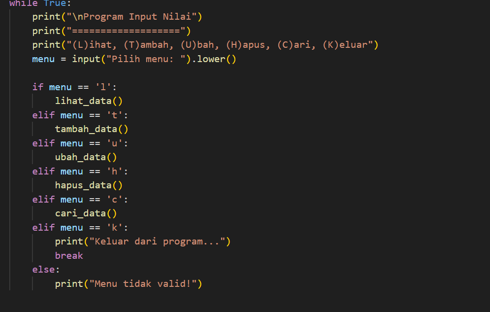

# Tugas Praktikum 5
## kode program daftar nilai mahasiswa

### Langkah 1
Buat dictionary kosong yang digunakan untuk menyimpan data mahasiswa. berisi antara lain nama, nim,  nilai tugas, UTS, UAS, dan nilai akhir.:

### Langkah 2
Menggunakan tampilkan_data untuk menampilkan daftar mahasiswa (nama dan nim) beserta nilai tugas, UTS, UAS, dan nilai akhir.Program mengecek apakah ada data mahasiswa di dalam dictionary data_mahasiswa. Jika ada, data akan ditampilkan.Jika tidak ada data mahasiswa, pesan "Tidak Ada Data" akan ditampilkan:

### Langkah 3
Gunakan tambah_data yang berfungsi untuk menambahkan data mahasiswa baru. Program meminta input NIM, nama, nilai tugas, UTS, dan UAS. Nilai akhir dihitung berdasarkan ketentuan: 30% untuk tugas, 35% untuk UTS, dan 35% untuk UAS. Kemudaian data mahasiswa disimpan dalam dictionary data_mahasiswa. Jika ada input yang tidak valid, program akan menampilkan "pesan kesalahan".

### Langkah 4
Menggunakan ubah_data untuk mengubah data mahasiswa yang sudah ada. penggunaa if dan in untuk Program meminta NIM mahasiswa yang ingin diubah. Jika NIM ditemukan dalam data_mahasiswa, maka fungsi tambah_data akan dipanggil kembali untuk meminta input data baru dan mengganti data lama. dan jika NIM tidak ditemukan, pesan "Data tidak ditemukan!" akan ditampilkan:

### Langkah 5
hapus_data digunakan untuk menghapus data mahasiswa (berdasarkanNIM). Program meminta input NIM yang ingin dihapus. Jika NIM ditemukan dalam data_mahasiswa, data tersebut akan dihapus, dan jika NIM tidak ditemukan, pesan "Data tidak ditemukan!" akan ditampilkan:

### Langkah 6
Meminta input NIM yang ingin dicari.
Jika NIM ditemukan dalam data_mahasiswa, data mahasiswa tersebut (NIM, Nama, Nilai Tugas, UTS, UAS, dan Nilai Akhir) akan ditampilkan. Jika NIM tidak ditemukan, program akan menampilkan pesan "Data tidak ditemukan!":

### Langkah 7
Perulangan while, Fungsinya untuk perulangan while sampai user berhenti menggunakan, perulangan ini akan terus berjalan selama kondisi True, yaitu tanpa henti. penggunaan elif dan if untuk menampilkan dan merubah data mahasiswa:

### Langkah 8
Setelah semua fungsi didefinisikan, program di run lalu hasil akan ditampilka:

