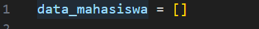

# Tugas Praktikum 5
## kode program data nilai mahasiswa

### Langkah 1
Buat dictionary kosong yang digunakan untuk menyimpan data mahasiswa. berisi antara lain nama, nim,  nilai tugas, UTS, UAS, dan nilai akhir.:

### Langkah 2
Cek apakah ada data mahasiswa yang tersedia. Jika tidak ada, menampilkan pesan "TIDAK ADA DATA".
Jika ada data, menampilkan tabel berisi NIM, nama, nilai tugas, nilai UTS, nilai UAS, dan nilai akhir.
penggunaa  loop untuk menampilkan setiap data mahasiswa:

### Langkah 3
Tambahkan data mahaiswa dengan penggunaan tambah_data, program meminta Pengguna untuk memasukkan NIM, nama, nilai tugas, nilai UTS, dan nilai UAS. Nilai akhir akan dihitung berdasarkan ketentuan: 30% tugas + 35% uts + 35% uas. setelah data dimasukkan program akan menyimpan dalam dictionary dan ditambahkan ke dalam data_mahasiswa. Jika berhasil akan ditampilkan "data berhasil ditambahkan":

### Langkah 4
Jika kita ingin mengganti data dengan menggunakan ubah_data. Program meminta user untuk memilih nomor data yang ingin diubah. tujuan nomor itu bergunakan untuk mengakses dan mengubah data yang ada.
Data yang dipilih akan diubah sesuai (NIM, nama, nilai tugas, nilai UTS, nilai UAS, dan nilai akhir).
Nilai akhir dihitung ulang berdasarkan ketentuan seperti pada fungsi tambah_data(). Menampilkan pesan bahwa data berhasil diubah.:

### Langkah 5
Jika kita ingin menghapus suatu data mahasiswa dengan menggunakan hapus_data. dengan melihat fungsi lihat_data() terlebih dahulu untuk menampilkan daftar data mahasiswa.
Pengguna diminta memilih nomor data yang ingin dihapus. data yang sudah dipilih akan dihapus menggunakan del. Menampilkan pesan bahwa data berhasil dihapus.:

### Langkah 6
Pengguna diminta untuk memasukkan keyword pencarian, yang bisa berupa nama atau NIM.
Program mencari data yang sesuai dengan keyword tersebut menggunakan list comprehension. Pencarian dilakukan secara case-insensitive untuk nama mahasiswa.
Jika data ditemukan, ditampilkan dalam bentuk tabel, mirip dengan fungsi lihat_data().
Jika data tidak ditemukan, menampilkan pesan "Data tidak ditemukan".:

### Langkah 7
Perulangan while, Fungsinya untuk perulangan data sampai user berhenti menggunakan, perulangan ini akan terus berjalan selama kondisi true atau tanpa henti. penggunaan elif dan if untuk menampilkan dan merubah data mahasiswa. program menampilkan "Program Input Nilai" lalu dibatasi dengan garis pemisah (===================) agar terlihat rapih, kemudian menampilkan pilihan menu dengan setiap pilihan yang dapat dilakukan oleh user:

### Hasil program

## Flowchart data nilai mahasiswa